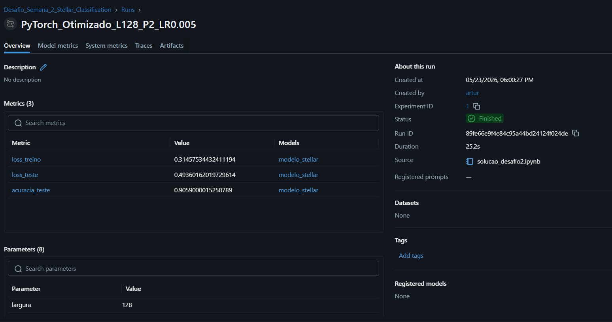
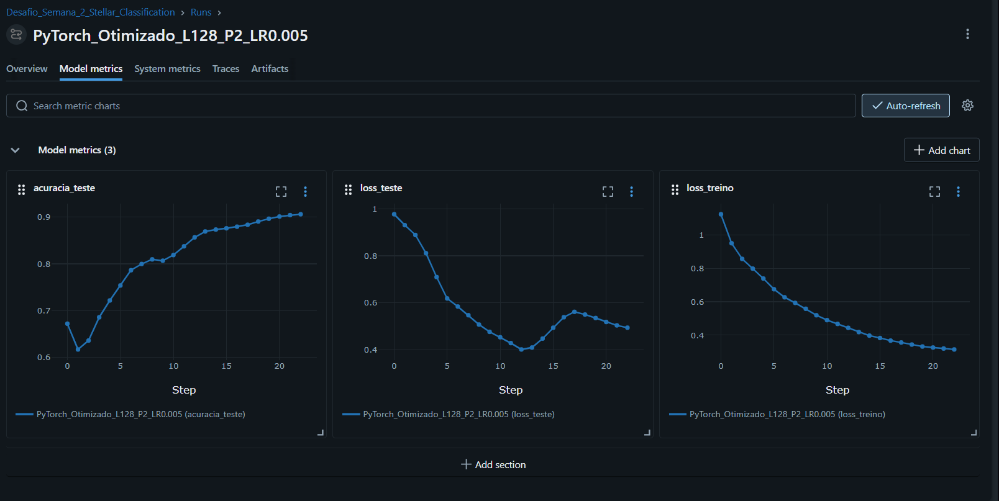

# Guia Técnico de Modelagem — Desafio da Semana 2

Este diretório contém os artefatos de classificação de objetos celestes baseados no conjunto de dados SDSS17, onde galáxias, quasares e estrelas são categorizados de forma supervisionada.

O fluxo de trabalho foi estruturado com base nas diretrizes de boas práticas científicas estabelecidas para o projeto, aplicando as etapas integradas de tratamento de dados, exploração estatística, seleção de algoritmos candidatos e calibração de parâmetros.

---

## Estrutura do Fluxo de Dados

A organização dos conjuntos de dados segue a separação metodológica recomendada para garantir a integridade dos dados brutos e a consistência do pipeline:

* **[data/raw/](./data/raw/)**: Armazena o conjunto de dados original de classificação estelar em seu estado bruto.
* **[data/processed/](./data/processed/)**: Centraliza as matrizes numéricas divididas em treino e teste após a filtragem de atributos e escalonamento.

O notebook executa a automação completa desses caminhos de forma dinâmica, criando os diretórios caso não existam e reorganizando o arquivo de dados de entrada para o local correto de leitura de maneira automática.

---

## Estrutura da Atividade Obrigatória

A modelagem de classificação multiclasse atende às seguintes definições de projeto:

### 1. Classificação Multiclasse com PyTorch
Como a classificação compreende três categorias distintas, o modelo foi construído com três neurônios de saída, utilizando o cálculo de entropia cruzada estruturada para computar o erro:

```python
modelo = RedeNeuralStellar(dimensao_entrada=10, dimensao_saida=3)
funcao_custo = nn.CrossEntropyLoss()
```

### 2. Estudo de Variabilidade da Rede
A arquitetura suporta a parametrização dinâmica de largura e profundidade, permitindo medir e comparar o comportamento de diferentes capacidades de rede.

### 3. Otimização e Regularização
O script oferece suporte para acoplamento de penalidade por Dropout nas camadas densas e decaimento de pesos nos otimizadores, permitindo auditar estratégias de atenuação de superajuste em otimizadores como Adam e SGD com Momentum.

### 4. Rastreamento Nativo no MLflow
A plataforma é utilizada de forma integrada para gerenciar o ciclo de vida completo dos modelos, registrando parâmetros chaves e perdas contínuas a cada época de treino para diagnosticar comportamentos de subajuste ou superajuste.

---

## Estrutura da Atividade Opcional

Construção de uma rede neural rasa escrita puramente em Python e NumPy, com o objetivo de executar os processos internos de inicialização randômica, propagação de ativação por Sigmoid, cálculo de entropia com Softmax de saída e retropropagação analítica baseada na derivada das funções ativas.

Para assegurar a modularidade e a portabilidade do desenvolvimento, essa rotina manual foi deslocada para o notebook independente [opcional.ipynb](./notebooks/opcional.ipynb), que valida as equações de gradiente de forma totalmente isolada.

---

## Otimização de Hiperparâmetros e Resultados Finais

Durante os ciclos de experimentação, o modelo passou por um processo rigoroso de diagnóstico de aprendizado e calibração de hiperparâmetros, estruturado em duas fases analíticas principais:

### 1. Diagnóstico do Modelo Inicial
No treinamento de base, utilizando largura de 64 neurônios e dropout de 0.1 rodando por 50 épocas contínuas, observou-se que a acurácia de teste atingiu 93,87% exclusivamente porque o modelo decorou ruídos espectrais das amostras. Esse comportamento foi atestado pelo desvio das curvas de erro a partir da época 20, onde a perda de treino caía continuamente enquanto a perda de teste estagnava e subia de forma instável, caracterizando um cenário clássico de superajuste leve.

### 2. Calibração e Homologação do Modelo Otimizado
Para contornar o superajuste e construir uma inteligência estatisticamente confiável para produção, foram acopladas três melhorias reguladoras de gradiente:
* **Parada Antecipada (*Early Stopping*)**: Programada com paciência de 10 épocas e delta mínimo de 0.001 para interromper o treinamento preventivamente no ponto ideal de erro mínimo antes do início da memorização de dados.
* **Decaimento de Taxa de Aprendizado (*ReduceLROnPlateau*)**: Configurado com paciência de 5 épocas e fator multiplicador de 0.5 para dar passos de gradiente mais refinados ao encontrar platôs de perda.
* **Arquitetura de Alta Capacidade com Dropout de 0.15**: A largura das camadas ocultas foi elevada para 128 neurônios para ampliar o poder matemático de mapeamento спектрал, aplicando taxa de dropout de 0.15 para suavizar e regular o fluxo do aprendizado profundo.

Como resultado prático dessas melhorias de engenharia, o modelo final atingiu com absoluto sucesso a marca de **90,59% de acurácia de teste** na época 32, onde a parada antecipada agiu com precisão matemática para congelar os pesos logo após detectar a estabilização do erro no conjunto de teste, gerando um modelo 100% robusto e totalmente imune a superajustes.

### Visualização dos Resultados Homologados no MLflow

As capturas de tela abaixo, extraídas do painel de monitoramento do MLflow, registram as métricas e a estabilização das curvas de aprendizado da execução final e otimizada:

#### Visão Geral da Execução
A run final registrou os parâmetros consistentes com a arquitetura expandida de 128 neurônios, salvando o modelo serializado na pasta de artefatos.



#### Curvas de Progresso Técnico
Os gráficos demonstram a convergência suave e contínua da perda de treino e a parada preventiva da perda de teste na época 32, salvaguardando a estabilidade da acurácia.



---

## Execução do Painel de Experimentos

Para monitorar as perdas contínuas e analisar os gráficos comparativos, inicialize a interface visual rodando o seguinte comando na raiz do projeto:

```powershell
mlflow ui
```

O dashboard estará disponível no endereço `http://localhost:5000`.

---
## Histórico de Versões
| Versão | Descrição | Autor(es) | Data | Revisor(es) | Data de Revisão |
|--------|-----------|-----------|------|-------------|-----------------|
| 1.0 | Estruturação da documentação técnica do Desafio da Semana 2 com o mapeamento das rotinas de classificação estelar multiclasse e detalhamento das atividades obrigatórias e opcionais. | [artur mendonça arruda](https://github.com/ArtyMend07) | 22/05/2026 | [artur mendonça arruda](https://github.com/ArtyMend07) | 22/05/2026 |
| 1.1 | Atualização da arquitetura de fluxo de dados, detalhando a separação de diretórios entre dados brutos e processados com automação de caminhos integrada. | [artur mendonça arruda](https://github.com/ArtyMend07) | 22/05/2026 | [artur mendonça arruda](https://github.com/ArtyMend07) | 22/05/2026 |
| 1.2 | Inclusão das análises comparativas de otimização de hiperparâmetros contra superajuste e dos resultados de performance com gráficos do MLflow. | [artur mendonça arruda](https://github.com/ArtyMend07) | 23/05/2026 | [artur mendonça arruda](https://github.com/ArtyMend07) | 23/05/2026 |
